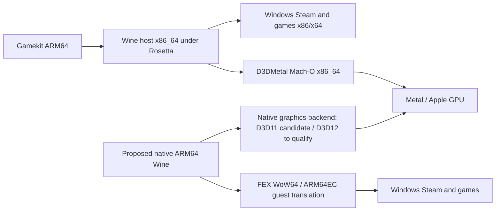

# macOS 28 runtime viability

Research date: **2026-09-18**. Issue: `gamekit-6v1`.

**September 21 follow-up:** [Native runtime candidate qualification](native-runtime-candidate-qualification.md)
records a newly evaluated public VKMT artifact, real native-host/x64 execution,
failed graphics gates, and the expanded ARM64 alternative search. The artifact
availability statements below describe the original September 18 investigation.

## Conclusion and support decision

**Keep the accepted Gamekit runtime supported on macOS 27 only.** There is no
source-backed assurance that Apple's macOS 28 legacy-game exception covers this
Wine/Windows Steam/D3DMetal stack. That is an unverified exception, not proof that
every Windows game will fail, and not permission to claim macOS 28 support.

**A credible replacement direction now exists:** native ARM64 Wine with a
Darwin-compatible FEX backend, plus a compatible native graphics path. CodeWeavers
announced such a macOS Preview in July 2026; new macOS cross-architecture facilities
address important Wine ABI obstacles. This supersedes an assessment based only on
older statements that native ARM64 Wine on macOS is impractical.

It is **not yet a qualified Gamekit replacement**. No authorized native Preview
artifact was available for this investigation, the public experimental Wine tree
does not include its complete external integration, and our current D3DMetal is
Intel-only. No replacement-runtime Steam or graphics pass, and no macOS 28 test,
is claimed. The deliverable is a dated evidence assessment and migration gates.

`PrototypeHostPolicy.macOSMajorVersion` remains 27. The proposed migration below
requires a separate candidate evaluation and user support-policy decision before
that constraint changes.

## What Apple actually says

- Apple's September 14 support article says Rosetta is generally available through
  macOS 27. From macOS 28 it is available only for **certain older, unmaintained
  games that rely on Intel-based frameworks** [1].
- Apple's September 1 developer announcement repeats the transition and exception
  and directs developers to migrate their apps [2]. Neither source identifies
  Gamekit, Sikarugir, arbitrary Wine loaders, or Windows Steam as covered. The
  evaluated sources do not supply an eligibility mechanism for our exact binaries.
- Apple's developer documentation states that Rosetta translates a whole process
  and that ARM64 and x86_64 macOS code cannot simply be mixed in one process [3].
  Recompiling the SwiftUI launcher cannot make its Intel runtime dependencies native.
- **Linux VM translation is a separate case.** Apple's current documentation says
  macOS 27 integrates Intel Linux binary translation directly, without a separate
  Rosetta installation [3,4]. Do not equate the macOS-app retirement with removal
  of that facility. It runs Linux ELF binaries inside ARM Linux VMs, not our
  existing macOS Wine/D3DMetal binaries. This also does not establish a gaming GPU
  path or a tested macOS 28 configuration.

No exception eligibility was invented from bundle names, game categories, native
Steam availability, or the fact that D3DMetal comes from Apple.

## Local evidence: the current dependency chain

Read-only inspection on the M4 Pro, macOS 27.0 build 26A428, using the accepted
text-input-1 runtime and package `Gamekit-20260918T164211Z`:

| Component inspected | Actual binary format/architecture | Consequence |
|---|---|---|
| Gamekit executable | Mach-O ARM64 | Native launcher already exists |
| Wine loader and wineserver | Mach-O x86_64 | Runtime still requires Intel host execution |
| Wine `ntdll.so` and `winemac.so` | Mach-O x86_64 | Core/graphics-window host modules are Intel |
| D3DMetal 4.0b2 framework executable | Mach-O x86_64 | No ARM64 slice in the installed graphics payload |
| `WineGameIdentity.dylib` | Mach-O x86_64; ad-hoc signature | Dock/Space helper must be rebuilt and signing reevaluated |
| Installed `Steam.exe` and `steamwebhelper.exe` | Windows PE32+ x86-64 | Guest CPU translation remains necessary with a native host |

This is an inventory of critical dependencies, not a claim to have audited every
transitive library. The inspected Intel loader alone rules out calling the current
stack ARM-native. Installer/prerequisite and older-title x86 requirements must
still be tested even though these two installed Steam executables are now x64.



### Read-only cross-architecture probe

`diagnostics/cross_arch_capabilities.c` compiles with the Xcode 27 SDK and queries
kernel capability/symbol availability. It does not switch ABI, change memory
permissions/page size, enable TSO, spawn Wine, install anything, or alter signing.

```sh
xcrun clang -arch arm64 -Wall -Wextra -Werror -mmacosx-version-min=15.0 \
  diagnostics/cross_arch_capabilities.c -o .build/cross-arch-capabilities
.build/cross-arch-capabilities
```

Observed: native ARM64 process, `sysctl.proc_translated=0`, 16384-byte host pages,
`os_cross_arch_is_supported(OS_CROSS_ARCH_X86_64)=true`, and all four queried symbols
present: `posix_spawnattr_set_4k_page_size_np`, `os_set_custom_x18_abi_enabled`,
`os_custom_x18_abi_enabled`, `thread_set_x86_64_compat`.

The SDK explicitly says a true capability query **does not imply any particular
compatibility layer is installed, enabled or functional**. Entitlement
authorization and actual cross-architecture execution were not tested by this probe.

## The significant new native-Wine work

Brendan Shanks' August 7 Wine development post describes CodeWeavers' macOS ARM64
Wine/FEX work and the required platform features [5]:

| Boundary | Why it matters | Evidence/qualification |
|---|---|---|
| x18 | Windows uses it for the TEB; Apple's ABI reserves it | Custom-x18 entry/exit must bracket Windows code and native callbacks/signals |
| 4 KB pages | Windows assumes 4 KB; this Mac normally has 16 KB | New spawn attribute provides the needed process environment |
| Low address space | Windows shared data and 32-bit guests need addresses below 4 GB | Special loader layout/linker support and provisioning are needed |
| x86 memory ordering | ARM ordering is different | Hardware compatibility/TSO must be enabled per emulation thread; not inherited |
| Authorization | These are restricted cross-architecture facilities | Developer App ID, appropriate capability, signing identity and provisioning profile |

The developer describes the integrated facilities as available in macOS 26.5,
with layout work in 26.4. The installed SDK has individual availability annotations
of 26.0 for the spawn declaration, 26.4 for x18, and 26.6 for the capability query.
Those annotations are not a tested minimum OS for a whole runtime. Our actual host
probe is on 27.0. The SDK also warns that custom-x18 mode cannot call arbitrary
macOS framework/POSIX code without switching back, and incorrect toggles abort.

The post names paid-account `com.apple.developer.cross-architecture-support` and
free-account `com.apple.developer.cross-architecture-support-unmanaged`. Ordinary
ad-hoc/JIT signing is not a substitute. The entitlement documentation URL linked
by a community integration returned 404 during this review, so the provisioning
details here are attributed to the Wine/CodeWeavers developer and still need
confirmation against the actual chosen artifact/account workflow. No security
settings were changed to test or bypass authorization.

## Candidate comparison

| Route | Evidence as of this review | Fit and remaining gate |
|---|---|---|
| **CodeWeavers ARM64 macOS Preview + FEX** | Publisher announced native builds July 31; its own public post describes the custom macOS FEX work [6]. Preview requires an active license [7]. | Best first candidate to evaluate through an authorized artifact. Initial launch coverage reported no D3DMetal/D3D12, broken launchers, and no existing-bottle conversion [8]. These are dated initial limitations, not proof of the September build's state. Obtain exact current release notes and test. |
| **Public experimental native Wine + external FEX/DXMT** | `gzimbric/wine-arm64-macos` at `e588cf66f022aeb7a4a0f5d95d8803ce7fb7fb98`, September 14, has seven Darwin patches on Wine 11.17. Author reports native/guest probes and D3D11 gameplay on one M5 Max [12]. | Useful source/design evidence, not a reproducible complete runtime. No binary assets; external FEX and DXMT changes are not published there. JIT W^X handling, x18 audit and packaging remain open. The Steam CEF workaround reduces process isolation and cannot be silently adopted. |
| **Stock Wine + upstream FEX** | Wine 10 implements ARM64EC and an external x64 emulator interface; Wine 11 improves large-host-page handling but notes limitations [9,10]. FEX documents ARM64EC/WoW64 integration [11]. | Important building blocks, not a turnkey Darwin stack. Linux installation instructions are not macOS installation instructions. A historical upstream FEX "no Mac plans" reply predates the custom CodeWeavers implementation and does not negate it [20]. |
| **Newer Intel macOS Wine package** | GCenx's current release listing is 11.17; its build configuration remains `x86_64-apple-darwin` [19]. | Wine version upgrade alone does not remove the host CPU-translation dependency. |
| **Ferrum / Bourbon** | Publisher reports native FEX-based work and D3D11 automated captures, but says no public Ferrum build, no end-to-end human gameplay acceptance and proprietary embedding/licensing [16]. | Watch candidate, not an available open-source drop-in. CPU microbenchmarks do not prove our games or D3D12. |
| **ARM Linux VM** | Apple's integrated Intel-Linux translation [4], or Linux FEX/Box64 [11,21]. | Changes product/OS architecture; requires a separately proven guest graphics path. Our Darwin D3DMetal library is not a Linux driver. No VM game test performed. |
| **Windows 11 ARM VM** | Microsoft Prism translates x86/x64 user-mode applications [18]. Parallels' August 25 gaming KB lists DirectX through 11.1, with VM/anti-cheat limits [17]. | Plausible for selected applications, not a demonstrated replacement for the accepted D3D12 game path. Requires its own OS/runtime licensing and integration. |

The public CrossOver stable changelog lists 26.3.0, not a stable native ARM64 Mac
release [22]. Its Preview FAQ also contains an outdated Intel-only sentence that
conflicts with the newer dated ARM64 announcement. Prefer the dated implementation
announcement for architecture and the access page for licensing; neither substitutes
for testing the exact downloaded Preview. Conflicting secondary estimates of the
future stable version/release date are not used as a delivery commitment.

### Graphics is an independent acceptance gate

DXMT's current source describes Direct3D 10/11 over Metal, **not D3D12** [13].
MoltenVK exposes a Vulkan portability subset, not every feature of a native Vulkan
driver [14]. vkd3d-proton has explicit Vulkan feature/descriptor requirements [15].
Thus "FEX supports AVX2" or "MoltenVK supports Vulkan 1.4" is not proof that
Helldivers' D3D12 renderer will work.

The installed Intel Mach-O D3DMetal cannot simply be loaded into native ARM64 Wine.
A suitable native vendor payload/bridge or an independently qualified alternative
is required. GPTK 4's public page describes Metal 4 evaluation and porting tools;
it does not promise macOS 28 operation for this particular Wine runtime [23].
Native game-porting tools also are not a general Windows CPU emulator.

## Migration plan and explicit blockers

### Phase 1: qualify a candidate, preserve the working setup

Follow-up **`gamekit-5wd`**:

1. Obtain an authorized native macOS Preview plus its precise version/release notes,
   or a complete reproducible source integration. No CrossOver app was present in
   the two standard Applications locations inspected; no Preview artifact was
   supplied. This does not determine whether the user owns a license.
2. Inspect Mach-O/PE architectures, signatures, provisioning, native dependencies,
   licenses and actual loaded modules. Reject hidden Intel-host/Rosetta fallback.
3. Create an independent disposable prefix. Validate native host execution, x86
   and x64 Windows programs, real AVX/AVX2 instruction execution, threads, exceptions
   and callbacks. Do not mistake a version string or CPUID advertisement for execution.
4. Run current Windows Steam through install/update, CEF login UI, restart and
   scoped Stop. Authentication remains in Steam; preserve other active sessions.
5. Run independent D3D11 and D3D12 device, queue, render/present/readback probes.
   Reuse existing probe sources where applicable; a D3D12 device alone is not a
   whole-game rendering pass.
6. Only then test approved titles, input, audio, save/reload and measured performance.
   Stardew gameplay/save testing remains user-controlled under the existing agreement.

The blocker today is not missing CPU theory: it is an authorized/reproducible full
runtime artifact, its provisioned execution path, current Steam compatibility and
the required native graphics implementation. Compiling the incomplete public Wine
tree would not validate its missing external integrations. We did not run an
irrelevant Rosetta baseline and label it replacement-runtime validation.

### Phase 2: integrate and qualify macOS 28

Follow-up **`gamekit-m47`**, dependent on `gamekit-5wd`:

- Introduce a distinct runtime/prefix/cache namespace, not an in-place
  text-input-1 component revision. Existing prefixes, saves and PE-sharing caches
  remain rollback assets; do not share mutable PE binaries across architectures.
- Rework the runtime adapter's prerequisites, loader paths, environment, process
  identification and scoped shutdown. Native runtimes must not inherit a blanket
  Rosetta prerequisite, but the existing Intel runtime must retain it.
- Rebuild or replace the x86_64 identity/Space helper. Validate Wine class/ABI
  assumptions, injection/library-validation rules and ARM64 code signing.
- Reconsider generated copied/renamed Wine app bundles: provisioned entitlements
  can depend on bundle identity/signature. The present ad-hoc clone strategy is
  not automatically valid for an entitled native loader.
- Reassess text-input and VC++ fixes against the candidate's own Wine/PE ABI.
  Preserve required behavior rather than transplanting old binaries blindly.
- Repeat actual CPU/Steam/graphics/game and lifecycle/rollback acceptance on a
  macOS 28 test installation. Change the host policy only after that evidence and
  the support decision are recorded.

There is no automatic runtime migration or host upgrade in this work. Near-term
cost is the existing macOS 27 setup; candidate evaluation may need a current
CrossOver license or provisioned source-build workflow and additional isolated
storage. No paid purchase or availability date is assumed. A Linux/Windows VM or
remote-streaming product would be a separate scope decision, not a transparent
replacement adapter.

## Source ledger and confidence

Sources below were reviewed on 2026-09-18. Search results were used to discover
sources, not as stand-alone proof. Some direct CodeWeavers blog article URLs
returned 403; the publisher's blog index, own LinkedIn post and Wine developer
mailing-list message were accessible. The initial Preview limitation list is
explicitly secondary coverage. The Apple forum thread returned a browser challenge
and is not used as authoritative evidence.

| Ref | Source | What it establishes |
|---|---|---|
| 1 | [Apple Support, Sept 14](https://support.apple.com/en-us/102527) | General macOS Rosetta cutoff and narrow game exception |
| 2 | [Apple developer news, Sept 1](https://developer.apple.com/news/?id=w5ngl9k2) | Developer migration direction and warning rollout |
| 3 | [Apple Rosetta architecture documentation](https://developer.apple.com/documentation/apple-silicon/about-the-rosetta-translation-environment.md) | Whole-process architecture rules; Linux translation distinction |
| 4 | [Apple: Intel binaries in Linux VMs](https://developer.apple.com/documentation/virtualization/running-intel-binaries-in-linux-vms.md) | macOS 27 integrated Linux translation; not Darwin/Windows execution |
| 5 | [Brendan Shanks, Wine-Devel, Aug 7](https://list.winehq.org/hyperkitty/list/wine-devel@list.winehq.org/thread/CKG5CEN2BE5VRXZ7O7NX4YUSBH3247WH/) | Native Wine ABI facilities, provisioning and CrossOver implementation |
| 6 | [CodeWeavers' own ARM64 announcement](https://www.linkedin.com/posts/codeweavers_we-are-elated-to-announce-that-todays-crossover-activity-7488944199262769153-9Ld4), [publisher blog index](https://www.codeweavers.com/blog) | July 31 macOS native Preview/custom FEX milestone |
| 7 | [CodeWeavers Preview Center](https://www.codeweavers.com/preview) | Active-license requirement, separate installation, no trial mode |
| 8 | [AppleInsider, July 31](https://appleinsider.com/articles/26/07/31/first-apple-silicon-native-crossover-build-in-testing-as-rosettas-end-nears) | Secondary report of initial Preview limitations, not current-build certification |
| 9 | [Wine 10 announcement](https://github.com/wine-mirror/wine/blob/wine-10.0/ANNOUNCE.md) | ARM64EC and external emulation interface; historical page-size restriction |
| 10 | [Wine 11 announcement](https://github.com/wine-mirror/wine/blob/wine-11.0/ANNOUNCE.md) | New WoW64 completion and qualified large-page support |
| 11 | [FEX ARM64EC/WoW64 integration](https://wiki.fex-emu.com/index.php?title=Development:ARM64EC&oldid=1638), [FEX 2609](https://fex-emu.com/FEX-2609/) | CPU-emulation interfaces, native host libraries, current development |
| 12 | [Experimental native Wine status](https://github.com/gzimbric/wine-arm64-macos/blob/e588cf66f022aeb7a4a0f5d95d8803ce7fb7fb98/docs/macos-arm64/README.md), [build/integration limits](https://github.com/gzimbric/wine-arm64-macos/blob/e588cf66f022aeb7a4a0f5d95d8803ce7fb7fb98/docs/macos-arm64/BUILD.md) | Author-reported single-machine results and missing external components |
| 13 | [DXMT README](https://github.com/3Shain/dxmt/blob/7c8dee1c2d73415301ceb7d1fa810861cef4cd67/README.md) | D3D10/11 scope |
| 14 | [MoltenVK README](https://github.com/KhronosGroup/MoltenVK/blob/4aaf714aa1b3e78e26ecfcefa9c75e9a576c500b/README.md) | Vulkan portability subset and limitations |
| 15 | [vkd3d-proton requirements](https://github.com/HansKristian-Work/vkd3d-proton/blob/master/README.md) | D3D12 backend requires specific Vulkan features |
| 16 | [Ferrum publisher status](https://pyrosoft.pro/ferrum/) | Proprietary/in-development status; public-build and gameplay limitations |
| 17 | [Parallels gaming KB, reviewed Aug 25](https://kb.parallels.com/en/122485) | DirectX 11.1 ceiling and VM limitations |
| 18 | [Microsoft: emulation on ARM](https://learn.microsoft.com/en-us/windows/arm/apps-on-arm-x86-emulation) | Prism user-mode x86/x64 translation; no driver emulation |
| 19 | [GCenx build configuration](https://github.com/Gcenx/macOS_Wine_builds), [11.17 assets](https://github.com/Gcenx/macOS_Wine_builds/releases/tag/11.17) | Newer Wine package still documents an Intel host build |
| 20 | [Historical FEX upstream Mac-support reply](https://github.com/FEX-Emu/FEX/issues/5046#issuecomment-3524972762) | Upstream statement is not a claim about later custom macOS forks |
| 21 | [Box64 README](https://github.com/ptitSeb/box64) | Linux userspace scope, not a Darwin drop-in |
| 22 | [CrossOver stable changelog](https://www.codeweavers.com/crossover/changelog) | Public stable 26.3.0 listing; distinct from ARM64 Preview |
| 23 | [Apple GPTK 4 overview](https://developer.apple.com/games/game-porting-toolkit/) | Porting/evaluation tooling; no coverage promise for this stack on macOS 28 |

Local evidence additionally uses Xcode 27's `spawn.h`, `os/arch/arm64.h` and
`mach/mach_traps.h`, `file`, `codesign -dvv`, `sw_vers`, and the checked-in read-only
probe. The positive kernel result is kept separate from authorization, runtime
compatibility and game acceptance.
